---
hide:
    - navigation
---

# Appearance

The default rendering method used in ParaView does not produce shadows, nor any other realistic lighting effects. In certain cases you might want to have an image that looks a bit nicer (for example, as cover image). So we'll look into a few ways of accomplishing more appealing images below.

## Shadows

By default, ParaView renders a 3D view using fairly simple (GPU-accelerated) rendering. For example, this saved screenshot of an isosurface from the CT-scan dataset shows no shadows, and only uses a single light source:

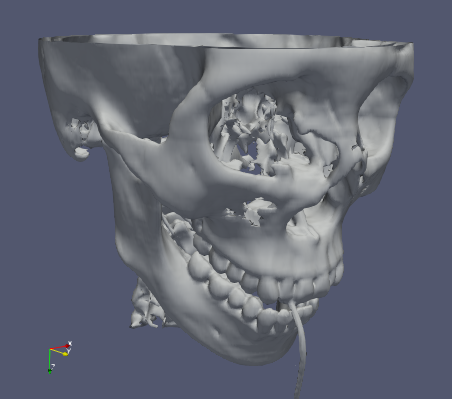

Such a rendering lacks clues that you as a viewer normally uses to understand shapes and spatial relations. Here is the same image with added shadows:

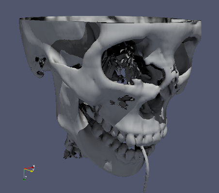

As you can hopefully see, such a rendering provides much more information. For example, the parts seen through the right eye are now clearly seen to be located quite far backwards, something that was hard to judge in the non-shadowed image, and you can judge how much overhang there is from the cheekbone.

To enable such shadowed rendering we used the *Raytracing* modes in ParaView. These use more advanced rendering and lighting techniques to produce more realistic renderings. To enable this *for the whole scene*, select a filter and check `Enable Ray Tracing` under the __Ray Traced Rendering__ property block (all the way at the bottom), and then check `Shadows`.

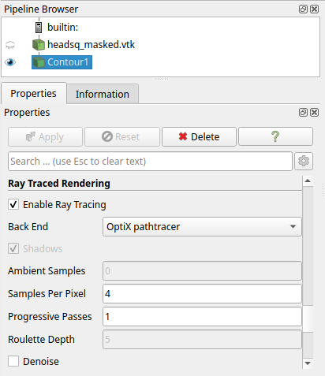

This will change the rendering mode and show shadows on objects, just like the image above.

!!! warning "Slow interaction with ray tracing modes" 

    Note that rendering and interaction can become quite a bit slower when enabling ray tracing.
    **This has an influence on the whole user interface**, and might make it almost unusable. So be somewhat careful in tweaking the ray tracing parameters, such as `Samples Per Pixel`, to high values. 

    In some cases it might be more effective to only use ray tracing mode when generating images from a Python script.

In this particular case we used the `OSPRay raycaster`, which is a CPU-based rendering mode with a fairly simple lighting model. Rendering and interaction speed will depend on the number of CPU cores in your system.

## Path tracing

A more advanced rendering method is Path tracing, which simulates more realistic lighting effects, such as light bouncing between surfaces reaching otherwise dark areas. 

There's two path tracer modes in Paraview, the OSPray path tracer and the OptiX path tracer. The former (OSPray), is always available and is CPU-based, while the latter (OptiX) is GPU-based and only available if your system has an NVIDIA GPU. So the latter is to be preferred if you can enable it, as it will lead to less interaction slowdown. The resulting images will differ somewhat in lighting between these rendering modes, by the way.

With pathtracer rendering the main setting to tweak is `Samples Per Pixel`. The higher you set this the less noisy and better the rendered image becomes (but remember the warning from above about slow interaction). For example, here's the isosurface as shown above, but now rendering with the OptiX pathtracer and 4 samples per pixel (left), or even less noisy, when using 16 samples per pixel (right):

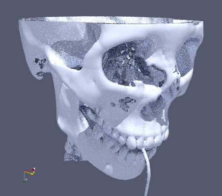 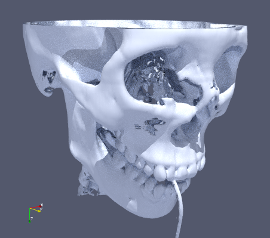

Compare the image using the shadowed raycasting we initially showed above, versus the path tracing image:

 

Much more light can be seen reaching the depth of the eye socket, and the shadows is general are less harsh. The reason for the difference in surface color is not just due to different lighting effects, but also because of a different surface [material](https://docs.paraview.org/en/latest/ReferenceManual/objectShadingProperties.html) used by default between these modes. 

Settings controlling material and appearance can be changed after enabling the advanced properties using { .iconimg }. ParaView comes with a list of pre-defined materials, for example, here's what we get when selecting `Metal_Copper_Flat` under __Material__ (in the __Ray Tracing__ section):

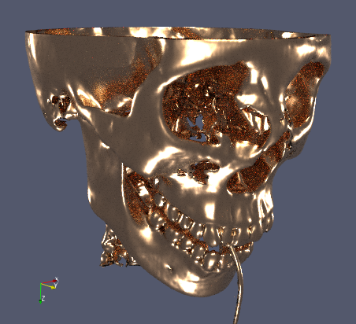

## Volume rendering

We briefly showed volume rendering in Exercise 1, but actually did not go into the most important part, setting the *transfer function*. The transfer function is used to control the appearance, in terms of color and opacity, of a volume. Simply speaking it maps a voxel data value to a (color, opacity) pair. By doing this for all voxels and compositing the visual result back-to-front an image is generated. It is a really powerful technique for visualizing volumetric data, but it can be a bit challenging to get good results.

The default transfer function in ParaView is linear, mapping the data range minimum value to fully transparent blue, and the data range maximum value to fully opaque red. See the graph representation and color bar in the Color Map Editor (**`View > Color Map Editor`**):

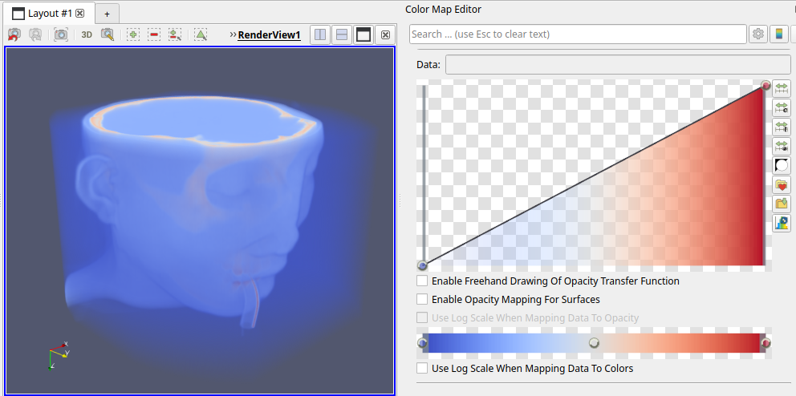

This default gives a fairly good overview of what's in the full dataset value range. But, for example, the values corresponding to the skull, which we know from the contour used earlier is around 2000, are mostly hidden by many layers of voxels containing the skin. We can just barely see a bit of the skull near the right eye show through.

We can try to show the bone more clearly by making the values 2000 opaque, and lowering the opacity of the existing points. By clicking in the graph we add a point, while dragging points allows control over both associated value (X) as well as opacity (Y):

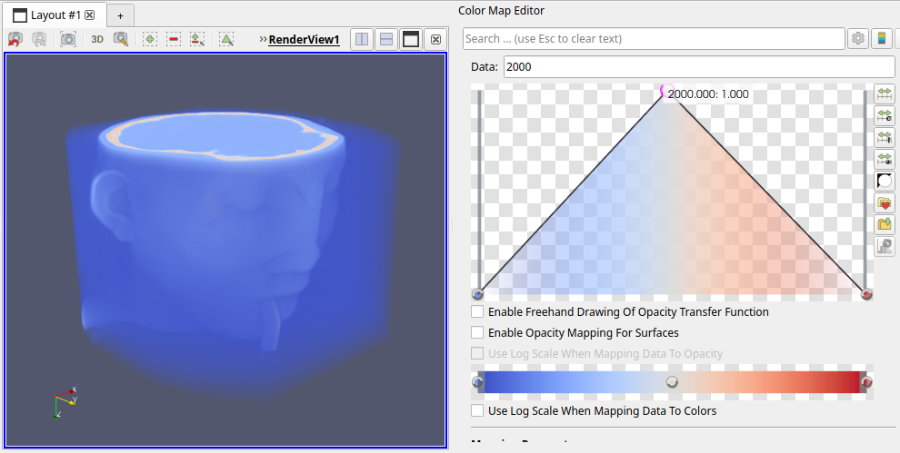

Unforunately, this hasn't helped much, although the rendering is slightly different. We're still seeing too much of the low values (blue). Let's add another point to bring down the low value range to complete transparency:

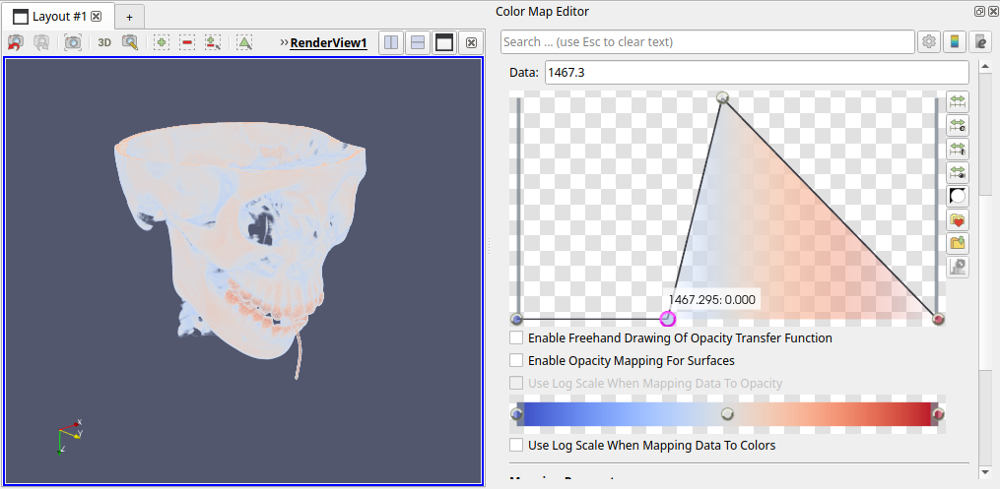

Now we're getting somewhere, it nicely shows the skull (and other higher-valued parts, like the vertebrae and teeth). The skull is shown almost fully white, though, with no good way to grasp its shape (similar to lack of shadows showed earlier). This is due to the simple rendering used by default for volume rendering: it only composites mapped voxel colors onto each other, there's no advanced lighting being applied. Luckily, there's a setting to improve this. We can enable `Shade` in the **Volume Rendering** section:

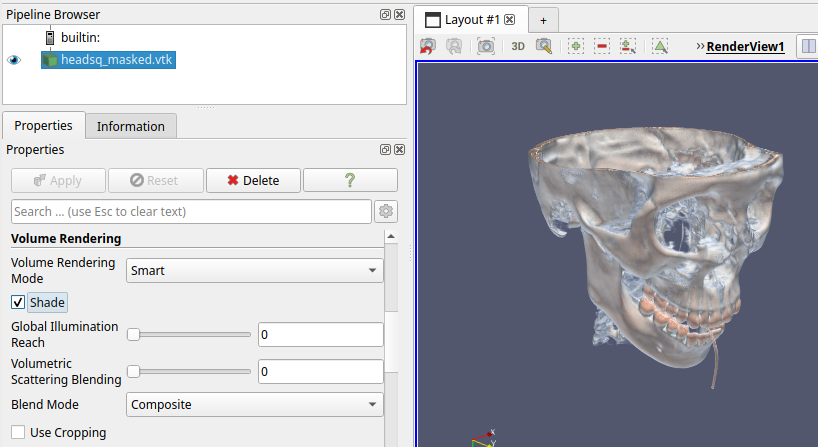

We can further tweak the colors of the different values in the transfer function, by clicking on a point in the color bar, pressing **`Enter`** and picking a more bone-like color:

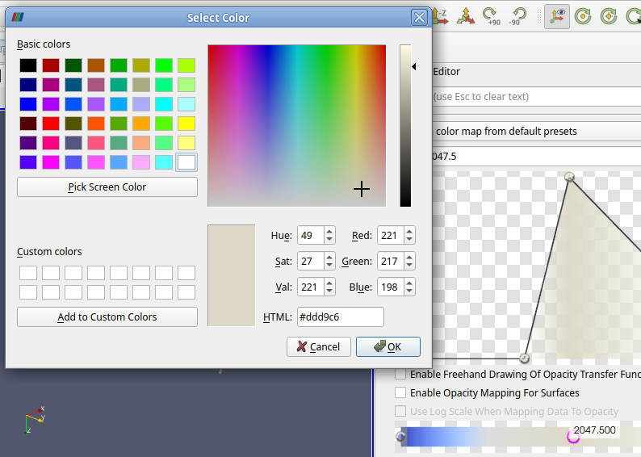

By tweaking the transfer function a bit more we can get a nice view of the bone parts, in the context of the skin, and even highlighting the teeth a bit in white:

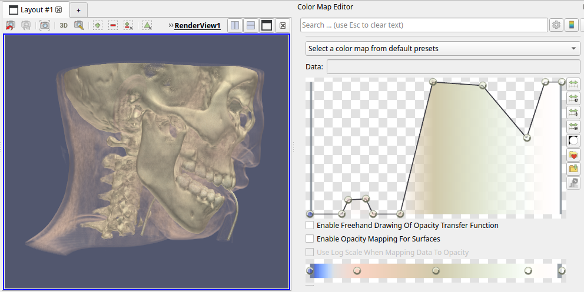

As you can see there's a quite lot that can be achieved by editing the transfer function. In this case we used a one-dimensional function, mapping data value to color + opacity. Recent versions of ParaView have [added](https://www.kitware.com/advanced-multi-channel-volume-visualization-in-paraview/) the ability to use a two-dimensional transfer function, which has data value and associated gradient value as input. This allows finer control over appearance of specific parts of a volume.