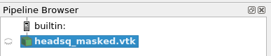
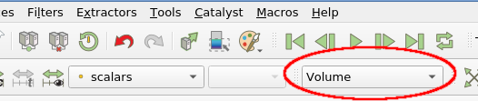
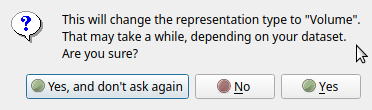
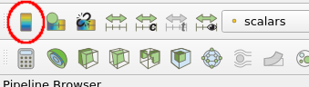
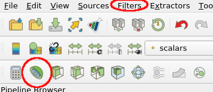
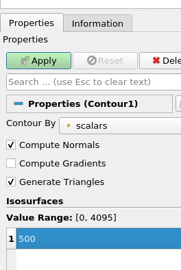
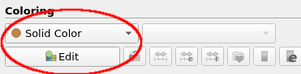
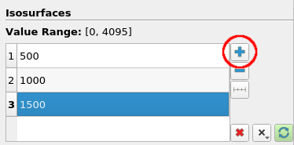
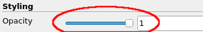

# Exercise 1 - CT scan of a boy

## First steps

In the first exercise we are going to take a look at a CT scan of a boy's head. A CT scanner produces a set of two dimensional X-ray images (usually called slices) that together form a 3D volume when stacked on top of each other. The 3D volume created in this way contains a density value for each voxel of the area scanned. As each part of the body (bone, tissue, blood, etc) has a different density w.r.t. X-rays these parts can be isolated and visualized using the density values.

The boy in this CT scan was sent to the hospital for a reason, and as part of the exercise you are encouraged to use ParaView to investigate and visualize the data set, to see if you can find out why he was in hospital.

▶ To begin, start the ParaView application. How to start ParaView depends on where you installed the binaries after downloading them.

▶ Once ParaView has opened, you have to load the first data file. To do this, you can use the open file icon in the toolbar, or __File → Open__ in the menu. Navigate to directory where you put the data, select the `headsq_masked.vtk` file and open it.

The pipeline shown in the Pipeline browser in the upper-left corner of the ParaView window should now show the loaded data file:

▶ Next we want to apply the changes to this pipeline (i.e. the actual loading of the data), by pressing __Apply__ in the __Properties__ tab, directly below the pipeline browser.

!!! Info "Lazy pipeline update"

    Remember that every time that you make changes to the pipeline or a filter's parameters, you have to "Apply" to make the pipeline execute.
    
    The reason for this is that a pipeline update can take quite some time, depending on the data size and operation. The manual apply allows you to make several changes to the filter first before triggering a pipeline update.

▶ Now we want to have a quick look at the data. By default, newly loaded items are made visible in the current view area on the right, and in the pipeline browser on the left you should see a small eye icon 👁 next to the __headsq_masked.vtk__ object. By toggling the eye you can toggle visibility, a useful feature to control what elements you want to see.

▶ Another handy thing to check is the metadata in the __Information__ tab, directly below the pipeline browser. It shows you the type of the dataset, the number of points and cells, data ranges, spatial extent, data memory size, etc.

▶ Try to get a bit of a feel for the mouse interaction in the 3D view (LMB = rotate, MMB = drag, RMB or wheel = zoom).

Right now, your data is visible only as an outline: a box made from a few white lines representing the spatial extent of your data. This does not give us much insight in the data, so we want to switch to something more suitable for the moment. 

▶ Use the visualization drop down menu in the toolbar to make a quick change to the visualization type. You can play around with the different representations available, with __Slice__ and __Volume__ being good ones for this type of data. When using Slice representation the slice direction and position can be controlled using the __Slicing__ settings in the Properties tab (the latter is directly below the pipeline browser on the left).

!!! Info "Volume representation 'Are you sure?'"

    

    When enabling Volume representation for the first time in a session, a dialog box may pop up asking if you are sure, which you can answer with Yes. For large datasets volume rendering can be problematic if your system doesn't have a lot of memory and/or has a slow GPU. For the datasets used here volume rendering on most systems should not be a problem.

Especially in Volume representation you can clearly see that indeed we are looking at the scan of a (boy's) head. 

▶ Switch to Slice representation and enable display of the color legend with either the __Show__ button under __Coloring__ in the properties, or using the Toggle Color Legend Button:

You should now see a color scale in the view area that shows how scalar values in the data are mapped to colors. 

▶Vary the slice position and orientation within the dataset using the Slicing properties (__Slice Direction__ and __Slice__).

## Isosurfacing

Our next job is to look into what this dataset contains. To be more precise, we want to explore certain features of the dataset in order to look for things out of the ordinary. For example, we are interested in physical structures such as bone and skin.

▶ To do this, we first need to add a __Contour__ filter to the pipeline: select the data source (__headsq_masked.vtk__) in the pipeline browser and add a Contour filter. You can do this by either using the icon symbol in the toolbar (half a sphere) or use __Filters → Common → Contour__ in the menu bar:

!!! Tip "Quick search to add a filter"

    When you know the name of the filter you want to add, a quicker way than navigating the Filter menu is to use **Ctrl+Spacebar**. This will show a search dialog where you can type (part of) the filter name and matching filters will get listed. Select the filter you want and press **Enter** to add it.

    Of course, make sure to have selected the filter whose input you want to use before adding the downstream filter.

▶ Next, we want to see what this filter does: in the __Properties__ tab, set the value of the contour under __Isosurfaces__ to 500 and click on __Apply__ and you should see a surface more-or-less representing the boy's skin.

▶ To get an even better view we can hide the slice view by clicking on the relevant eye icon in the pipeline browser. You should now see the contour surface by itself. 

Another thing you might want to do is play with the color settings. For example setting the color of the contour surface to something more skin-like than gray might be an improvement. 

▶ To alter the color click select __Solid Color__ under __Coloring__ (directly below the isosurface value settings), click the __Edit__ button and select the color: 

Next we want to add some more contour surfaces representing certain features in this dataset, such as bone. To do this, we want to add a few more iso-surfaces to our contour plot.

▶ Use the add value button (the +) of the Contour filter's __Isosurfaces__ section, fill in some extra values and hit __Apply__ when done. 

!!! Hint

    Try, for example, isovalues 1650 and 2750.

Note that although we now have multiple surfaces, one for each scalar value, they all have the same color, making them hard to distinguish. We can _assign a separate color for each scalar value_ to overcome this. 

▶ Under __Coloring__ change the coloring mode to __Scalars__. Check the color scalar against the color of the surfaces shown.

## Transparency

▶ The surfaces are now a bit easier to comprehend, although you might have to search a bit for the surface for the highest scalar value (check the color scale what color it should be). 

We can improve things even further by using a bit of transparency.

▶ Set __Opacity__ to a lower value, for example, 0.3:

▶ Finally, play a bit around with the viewpoint and inspect the visualization closely, and you should be able see why this boy was in hospital...