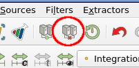
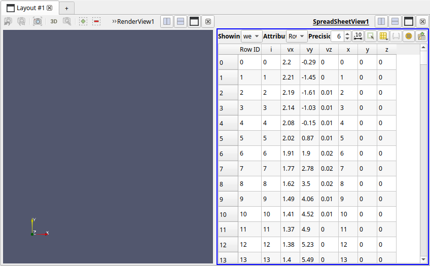
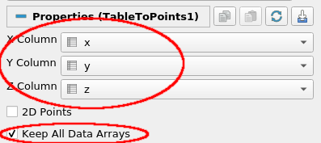
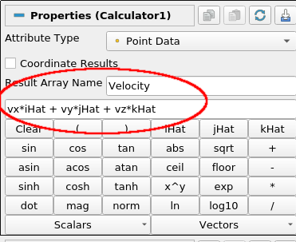
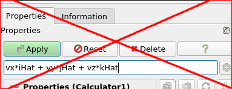
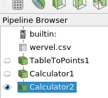
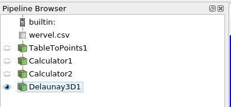
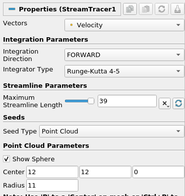
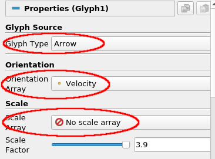

# Exercise 2 - A Tornado simulation

## Importing and preparing the data

In this exercise we will take a look at the results of simulating the wind in a tornado. The relevant dataset contains velocity vectors on a regular 3D grid (a so-called flow field). The data is contained in a simple file format: the well-known comma separated values format (CSV). 

The advantage of CSV is that it is a simple and human-readable format, and can be written and read by many applications. However, it is not always an efficient way of storing (large) datasets. 

The data contained in the CSV file is not automatically identified and understood correctly by ParaView, it simply does not have enough information for that. Therefore when we open a CSV file, we first have to apply some filters to map the data to the correct data arrays that we can operate on. After this is done, we can use a stream-tracer filter on it to get a good impression of the wind flow in this simulation.

▶ The first thing to do is to create a new session, and start with a clean view. For this, use the disconnect button in the toolbar and pressing __Yes__ (or the __File → Disconnect__ menu option). This will completely clean your current pipeline, so you can start the next exercise:

▶ Open the __wervel.csv__ file and click __Apply__. ParaView will ask which reader to use, pick __CSV Reader__ and click __Ok__. Next, use __Apply__ to actually load the data. A new view pane with a table representation of the data will get added next to existing the 3D view. The table is similar to an Excel sheet:

If you would open the CSV file in a text editor you would see the file contains 7 values per line, with each line representing one grid point. 

These values are:

* A unique identifier per point, __i__
* __x__, __y__, and __z__ values defining a location on a 3D cartesian grid.
* __vx__, __vy__ and __vz__ values, representing a 3D velocity vector at the (x,y,z) location

▶ Verify that the ParaView spreadsheet view indeed shows the same set of data.

ParaView does not know by itself how these individual variables relate to the points and cells in its data model, so we have to provide that mapping manually.

▶ The first step is to add a __TableToPoints__ filter to our data source. This filter creates a 3D point for each row in the table, based on a set of table values you choose. You can find this filter under __Filters → Alphabetical → TableToPoints__. Set the __X__, __Y__ and __Z__ columns correctly to the table columns representation point position, check __Keep All Data Arrays__ and hit __Apply__.

▶ Compare the __Information__ tabs of the __wervel.csv__ source and the __TableToPoints__ filter to see how the output data has changed (type, number of points/cells, etc), and verify that the data arrays produced by the TableToPoints filter match those of the wervel.csv source.

▶ If needed, enable visibility of the TableToPoints output by clicking the eye icon next to it in the pipeline browser. **If you have both a RenderView (the 3D panel) and a Spreadsheet view then make sure you have the RenderView selected (by clicking in it) before enabling visibility of the TableToPoints output.** You should now see a regular 3D grid of (white) points, indicating that the point position values from the CSV data have correctly been set based on the table input.

## Creating velocity vectors

Next, we need to combine the three separate scalar values __vx__, __vy__ and __vz__ into one 3D vector value. To do this, we use the __Calculator__ filter that is built into ParaView. 

!!! Note

    There is also a __Python Calculator__ filter, which is more powerful, but we don't use it here as it is somewhat buggy for what we want to do here.

▶ With the __TableToPoints__ filter selected add a __Calculator__ filter (__Filter → Common → Calculator__). In the __Result Array Name__ field enter "Velocity", in the text box below that enter the exact expression shown and hit __Apply__. This will create a __Velocity__ data array that holds the vector value (vx,vy,vz) for each point. Again, check the filter output data on the Information tab to verify this.

!!! warning

    A common mistake is to enter the expression in the Search box **above** the calculator properties:

    

    This will cause properties to get filtered on the entered text (which there aren't), hiding them all.

You will probably have understood the name __iHat__ to represent the vector __î__, i.e. (1, 0, 0). Using the Calculator filter fairly complex expressions can be used to augment existing datasets with new and useful values, both scalars and vectors.

▶ Select the Calculator filter in the pipeline and add *another* Calculator filter, for creating an array __VelocityMag__ and expression `mag(Velocity)`.

▶ The pipeline we built up to this point, shown above, creates a Polygonal Mesh dataset which contains only points: the input point positions with their respective 3D velocity vectors. You can see this on the __Information__ tab of the Calculator filter in the pipeline browser. Note that there's only 1 cell, and it contains all the 25,000 points. We also added two quantities derived from the input data, a velocity vector and its magnitude.

## Visualizing the flow field

Now that our data is converted from the CSV input to the ParaView data model we can start looking at our flow field. To do this, we want to use the _stream-tracer filter_. With this filter we simulate injecting particles in our flow field at specific locations. By letting these particles follow the flow, based on the velocity vectors in the grid, and tracing them over time we get an impression of the fluid flow through the model. 

The stream-tracer filter is based on tracing a virtual particle through the _cells_ of a dataset, i.e. regions of model space defined using 3D points. The flow direction within a cell, as indicated by the velocity vector value, is then integrated by the filter to determine a particle's position over time, thereby creating a trace of the particle through the dataset. 

But as noted above, *there's currently only a single cell in our dataset holding all the points*, which provides no meaningful way to trace particles. So we need to divide up the dataset domain into small cells. Furthermore, the flow vector values are currently associated only with the _points_ of the dataset, while we need those values for each _cell_ for the stream-tracer to work.

We can fix these two issues by applying a 3D Delaunay triangulation. This creates cells from the dataset based on the existing points. The cells created are small and detailed enough so that our Stream Tracer filter can reasonably work. The filter also adds a new flow vector value for each created cell, based on interpolating the existing per-point values of its corners.

▶ Select the __Calculator2__ filter and add a __Delaunay 3D__ filter using __Filters → Alphabetical → Delaunay3D__ and click __Apply__. It might take a few seconds to a minute for the computation to complete.

The representation of the data in the 3D view will now have changed to a block, instead of points, indicating that there are now cells which take up regions of 3D space.

▶ Check the __Information__ tab for the __Delaunay 3D__ filter and switch to __Surface with Edges__ representation to see how the data has changed, in terms of type, cells and points. You could also clip away part of the dataset with the __Clip__ filter to look at the cell structure inside of the dataset.

The pipeline we constructed so far should look like this:

Now lets do some initial particle tracing through the flow field using the stream tracer filter.

▶ In the pipeline, select the __Delaunay3D__ filter and add a __Stream Tracer__ filter. You can find this under __Filters → Common → Stream Tracer__. *Do not press Apply just yet*.

▶ The Stream Tracer filter has quite a few __parameters__. Important ones are integration settings and the seed location for the particles to trace. Change them to, for example, the __values below__ and click __Apply__:

This will give you a set of lines, each representing a trace of a particle as it follows the flow in the tornado. 

▶ Note the small red 3D axis and large sphere at the bottom of the tornado: this is the seed center (12,12,0) and given radius around which the traced particles start. You could experiment with different locations of the seed point to see how this influences the streamlines.

!!! Hint "Accidental sphere changes / Resetting a filter to last executed values"

    The sphere shown can actually be moved by dragging in the 3D view, which alters the corresponding values set for the Point Cloud Parameters. Sometimes, during 3D interaction with the view you might accidentally change a widget, such as the sphere here (there's more widgets, for example to set the location of a clip plane), which changes filter parameters. In case you did not want this to happen you can reset a filter back to the values it used since the last Apply by using the __Reset__ button at the top of the Properties panel.

    In most cases a widget can be hidden using a filter option, which prevents further interaction with it. Hiding the sphere here can be done by disabling the
    __Show Sphere__ option under Point Cloud Parameters.

▶ To make the streamlines more visually appealing, we add another filter on the output of the StreamTracer filter, namely a __Tube__ filter (__Filters → Alphabetical → Tube__). In the Tube filter's __Properties__ tab, set the radius of the tubes to 0.1 and click __Apply__. Notice how this changes the appearance
of the streamlines.

▶ At this point, we'd like to add the original data domain as an outline. For this, enable visibility of the __TableToPoints__ filter and switch its representation to __Outline__.

▶ You can experiment with different colorings of the tubes, based on e.g. velocity, angular velocity or rotation. Use the coloring controls in the filters settings under __Coloring__ for this.

## Glyphs

Finally, we'll add a different representation instead of the streamlines, called _glyphs_. Glyphs are simple and (usually) small 3D objects, like arrows or spheres. These glyphs get placed at each point position in a dataset to show a particular value. The glyphs are then colored, scaled and/or oriented based on scalar or vector values at the location. We'll use arrow glyphs to show the flow velocity magnitude and direction in the tornado.

▶ Hide all filter output, except the __TableToPoints__ filter (the domain), by clicking the relevant eye icons. 

▶ Select the __Calculator2__ filter and add a __Glyph__ filter (__Filters → Common → Glyph__). Set the __Glyph Type__ to __Arrow__, set the __Orientation Array__ to __Velocity__ (i.e. our computed velocity vectors) and __Scale Mode__ to __No scale array__. Click __Apply__. 

!!! Info "Point versus cell input"

    Note that there is no need to base the Glyph filter on the Delaunay 3D output, as the Glyph filter works on 3D *points*, as in the original data set. This is unlike the Streamtracer filter needing *cells*, which we added using the Delaunay 3D filter.

    ParaView does provide generic `Point Data to Cell Data` and `Cell Data to Point Data` filters, to convert between the two using interpolation.

You should now see a large number of arrows nicely distributed over the tornado dataset, indicating the direction of wind flow. As we have set the Scale Mode to Off all arrows are the same size, obscuring the insides and giving less of a visual clue to wind speed.

Let's try to improve the overall visualization, to make it easier to interpret.

▶ Set the __Scale Array__ to __Velocity__ and the __Scale Factor__ to __0.2__ and press __Apply__. 

▶ Make sure the coloring is set to __VelocityMag__ and verify that the size and colors of a glyph arrow corresponds to its velocity value.

You might wonder about the the number of glyphs placed, compared to the 25,000 points in the dataset. There is currently quite a large number of glyphs, and perhaps still too many to be effective. This doesn't help in the overall visual interpretation of the data, but we do need to balance getting enough coverage of the full dataset.

▶ The filter settings under __Masking__ provide different modes options for the number and distribution of the glyphs placed. For example, see what happens when using Glyph Mode `Every Nth point` when you show a glyph for every 10th or 11th point. Or use 500 glyphs uniformly distributed (and why that means you need choose these kinds of parameters with care).

▶ A useful variant is to apply glyphs *to the output of the Stream Trace filter* (by creating a second Glyph filter). This is possible because the generated streamlines are themselves polygonal data, where each streamline consists of a Poly-Line cell that uses a set of 3D points. As a Glyph filter uses point positions to place glyphs we can place them for each streamline. Experiment with this, using different types of glyphs, like Sphere and Arrow. Also try coloring by IntegrationTime to verify the direction in which the streamlines where "grown".