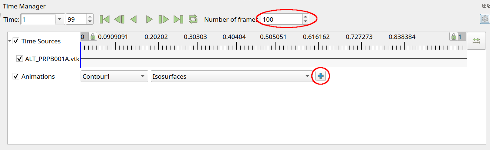
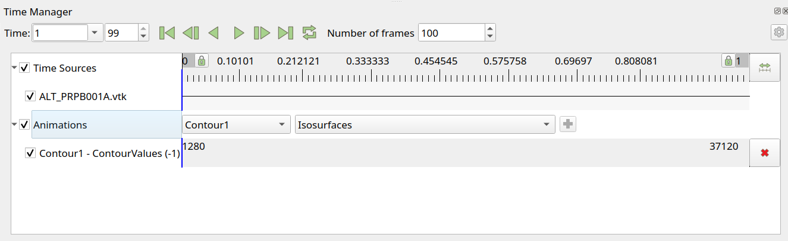
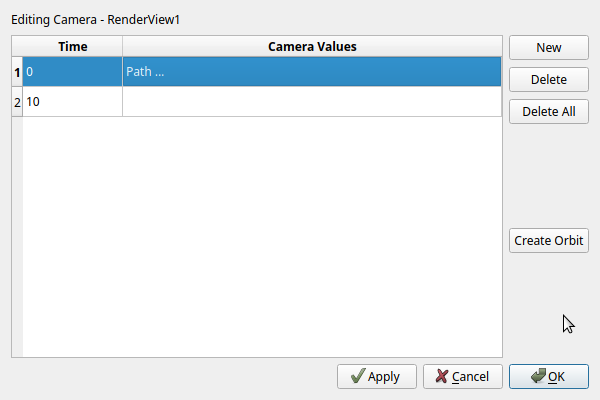

# Exercise 3 - Time-dependent Visualization

## Animating a contour value

In this exercise, we are going to look at time-dependent data. The data we use for this was produced by a computer simulation of coral growth. The file used contains a 3D regular grid, where each grid cell has a scalar value that defines the _time step_ when that grid cell was filled with the growing coral in the simulation. We are going to use the animation tools in ParaView to link data to a time sequence.

▶ If you currently have any data loaded use the disconnect button/icon or __File → Disconnect__ to clean your current workspace.

▶ Open the file containing the coral data set, named __ALT_PRPB001A.vtk__, located in the data directory and click __Apply__.

▶ Add a __Contour__ filter to this dataset and hit __Apply__ again. 

You should now see a contour surface of one single time point in the growth of the coral. However, what we want is to have the contour plot
change dynamically over time, showing us the growth of the coral over time.

▶ To achieve this, we need to open the _Time Manager_, which can be enabled from the main menu with __View → Time Manager__. In the time manager toolbar, set __Number of frames__ to __100__. 

!!! warning "Time Manager in older paraview versions"

    In ParaView versions before 5.12 the Time Manager was called the _Animation View_, also available under the _View_ menu. It is very similar to the Time Manager in 5.12, but not completely the same. So you might have to puzzle a bit how to use it in those older versions.

▶ Link the contour iso-surface value to the time sequence by using the blue __+__ button right of the __Contour1__ and __Isosurfaces__ dropdown menus.

▶ Verify that this adds __Contour1__ to the timeline, directly under __Animations__ as a second "strip" over the full length of the time bar. The values at the far left and right edges of the strip are the isosurface values used at those time points (1280 and 37120, respectively). These values are based on the min/max values from the input dataset, which can you verify using the __Information__ tab of __ALT_PRPB001A.vtk__.

▶ With the animation set up you can now use the playback buttons, either in the Time Manager or in the main toolbar, to play through the growth of the simulation. The double arrow button controls if the playback loops back to the start. When the animation is paused you can change the current time by clicking or dragging in the Time Sources bar.

▶ Notice how the contour value used changes during animation playback.

## Camera animation

Since the coral is a three-dimensional structure, it is nice to look at all sides of the structure over time. To do this, we will add a camera path that orbits around the coral as it animates.

▶ The coral grows in the -Y direction, which you can verify by looking at the small 3D axes in the lower-left of the 3D view. This is unfortunate, as by default the data is shown upside-down. We will set up a good view using the toolbar buttons for viewing directly along one of the coordinate axes. Press the __+Z button__ to look along the +Z direction, with +Y up, then press the __+90 button__ twice to rotate the view to -Y up.

▶ Verify that the animation playback now shows the coral nicely growing __upwards__, with the data ground plane horizontal. 

Next, we will add a circular camera motion, a so-called _orbit_.

▶ In the Time Manager in the Animations row select __Camera__ from the left-most drop-down box, and __Follow Path__ in the dropdown right to it. Then create a camera animation strip by pressing the blue __+__ button. This will add a __Camera - RenderView1__ strip. If you play the animation you will see the scene rotates over time, however, *the data is shown upside down...*

So the default camera orbit needs some tweaking, as it is set up based on the current view. For example, the camera might be a bit too close to the coral object and we want to move it back a bit. 

▶ Bring up the animation parameters by double-clicking on the Camera strip in the Time Manager, this will show the __Animation Keyframes__ dialog.

There are currently only two key frames defined, for time 0 and time 1. We will change the values for time 0 to tweak the camera animation.

▶ Select the row for time 0 in the dialog and click __Create Orbit__. This will show the Create Orbit dialog. The __Center__ value is the point around which the camera is rotated, __Normal__ is the vector used for the rotation and the __Origin__ is the initial camera position. Set the __Normal__ value to be -Y up __(0, -1, 0)__, or else the might be some weird rotation during the orbit. Normally, you will need to experiment in your own scenes to figure out correct values, **but use the ones given below** and press __Ok__.

▶ Press __Ok__ in the Animation Keyframes dialog to apply the new values. Play back the animation again and observe a nice rotation of the data as the coral grows.

▶ You can try experimenting with some different orbit parameters, to get visually different animations.

!!! Tip "Saving the animation to a video"

    Although not part of this exercise, it is really easy at this point to save the animated view to a movie file from ParaView. Use **File → Save Animation** for this. You can either save to a sequence of images, or directly to a video file, such as a .avi or .ogv. In this case it's best to set the __Frame Rate__ value to something like 20 (leading to a 5 second animation, as we have 100 frames).