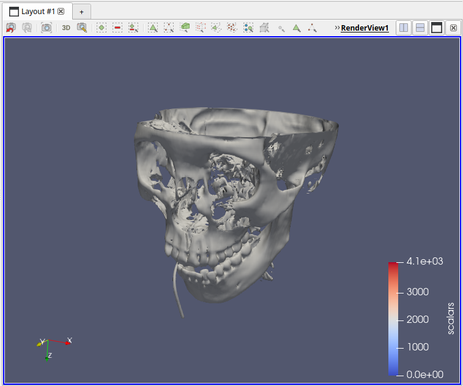
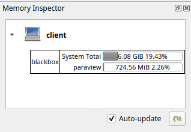

---
hide:
    - navigation
---

# Further information

## Official resources

The official [ParaView User Guide](https://docs.paraview.org/en/latest/UsersGuide/index.html) is quite good and contain lots of detailed information on data analysis and visualization with ParaView. The [ParaView Reference Manual](https://docs.paraview.org/en/latest/ReferenceManual/index.html) has more information on UI components and Python scripting.

The section on the ParaView [data model](https://docs.paraview.org/en/latest/UsersGuide/understandingData.html#vtk-data-model) can be especially relevant to understand how filters operate, and how to represent different types of datasets within this model.

There's also a whole set of official [tutorials](https://docs.paraview.org/en/latest/Tutorials/index.html), from basic UI elements and tasks,
to more advanced data analysis, animations, Python scripting and much more.

For asking questions, and as a knowledge-base, there is the ParaView [Discourse forum](https://discourse.paraview.org). Many ParaView developers are active on the forum, helping users with questions or problems.

## Interface guide

### Common view types

The type of the main view can be changed, or even split into multiple views of the same or different types.

XXX type list

* The **Render View** is the default and most used one. It provides an interactive 3D view where output of filters is shown. Per filter a visual representation can be chosen, as well as visibility per filter.

    {: width=500px }

* The **SpreadSheet View** shows underlying point and cell output data (and other types) of a single filter. This can be really useful to understand the underlying data values, to see if your import worked correctly, if a Python script generates correct values, etc.

    {: width=500px }

* Some filters output statistics in a bar chart. For example, when you add a Histogram filter a **Bar Chart View** automatically gets added, splitting the existing view.

    {: width=500px }

* Something similar happens with filters producing line charts. For example, the Plot Over Line filter adds a **Line Chart View**.

    {: width=500px }

### Memory inspector

As shown in the interface guide above, the memory indicator at the bottom of the window shows total system memory used. When enabling `View > Memory inspector` a panel is added that also shows the current *ParaView* memory usage for the data loaded and filtering applied, as well as the overall system memory usage.

### Statistics inspector

Enabling `View > Statistics inspector` will add a panel showing high-level information on all different filters in the pipeline. This includes geometry size for rendering, which is something not shown in the regular Information panel.

## Tips

### Filter quick search

With **`Ctrl+Space`** you can bring up the filter quick search menu:

By typing the first few letters of a filter name, `cont` in this case, you can quickly find and add a filter as a child of the currently selected filter in the pipeline browser. The greyed out filter names indicate the filter is not compatible with the currently selected filter's output data type.

