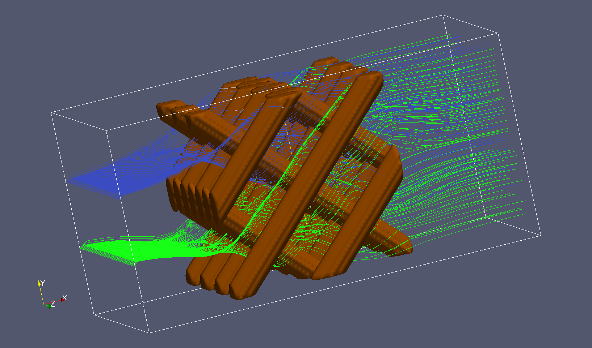

{ width=600 }

These is the hands-on part of our introductory course of scientific visualization with ParaView.

## Authors

Paul Melis, Casper van Leeuwen (SURF)

Robert Belleman (University of Amsterdam)

## Conventions

Whenever there is a step to perform in an exercise this will be marked with a ▶ character. For example:

    ▶ Please perform this instruction