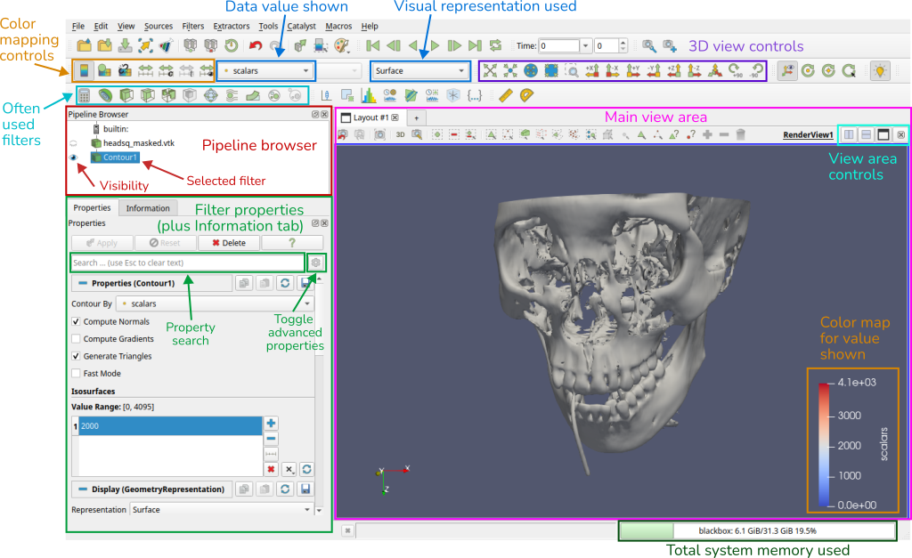
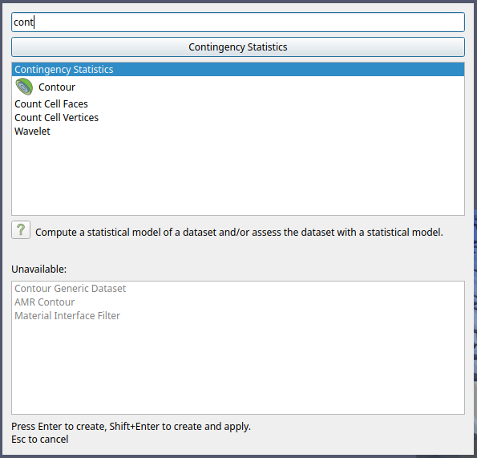

---
hide:
    - navigation
---

# Miscellaneous

## Official resources

The official [ParaView User Guide](https://docs.paraview.org/en/latest/UsersGuide/index.html) is quite good and contain lots of detailed information on data analysis and visualization with ParaView. The section in the User Guide on the ParaView [data model](https://docs.paraview.org/en/latest/UsersGuide/understandingData.html#vtk-data-model) can be especially relevant to understand how filters operate, and how to represent different types of datasets within this model. More information on the different file readers supported by ParaView can be found [here](https://www.paraview.org/Wiki/ParaView/Users_Guide/List_of_readers).

The [ParaView Reference Manual](https://docs.paraview.org/en/latest/ReferenceManual/index.html) has more information on UI components and Python scripting.

There's also a whole set of official [tutorials](https://docs.paraview.org/en/latest/Tutorials/index.html), from basic UI elements and tasks,
to more advanced data analysis, animations, Python scripting and much more.

For asking questions, as well as a knowledge-base to search, there is the ParaView [Discourse forum](https://discourse.paraview.org). Many ParaView developers are active on the forum, helping users with questions or problems.

## Interface guide

### Common view types

The type of the main view area can be changed, or even split into multiple view areas of the same or different types. The buttons marked *View area controls* above allow these changes. When adding a view area, or changing the main area, a menu is shown with the different types of views that can be created:

{: width=500px }

Below, we describe a few of these.

* The **Render View** is the default and most used one. It provides an interactive 3D view where output of filters is shown. Per filter a visual representation can be chosen, as well as visibility per filter.

    {: width=500px }

* The **SpreadSheet View** shows underlying point and cell output data (and other types) of a single filter. This can be really useful to understand the underlying data values, to see if your import worked correctly, if a Python script generates correct values, etc.

    {: width=500px }

* Some filters output statistics in a bar chart. For example, when you add a Histogram filter a **Bar Chart View** automatically gets added, splitting the existing view.

    {: width=500px }

* Something similar is done for filters producing line charts. For example, the Plot Over Line filter adds a **Line Chart View**.

    {: width=500px }

### Memory inspector

As shown in the interface guide above, the memory indicator at the bottom of the window shows total system memory used. When enabling `View > Memory inspector` a panel is added that also shows the current *ParaView* memory usage for the data loaded and filtering applied, as well as the overall system memory usage.

### Statistics inspector

Enabling `View > Statistics inspector` will add a panel showing high-level information on all different filters in the pipeline. This includes geometry size for rendering, which is something not shown in the regular Information panel.

## Tips

### Quick filter search

With **`Ctrl+Space`** you can bring up the filter quick search menu:

By typing the first few letters of a filter name, "cont" in this case, you can quickly find and add a filter as a child of the currently selected filter in the pipeline browser. The greyed out filter names indicate that that particular filter is not compatible with the currently selected filter's output data type.

### Getting filter help

Pressing the **`?`** button at the top of the current filter's properties will show a help screen for that filter type. It will contain a description of what the filter does, its input(s) and output(s), its settings, and any other useful information.

### Searching and finding (hidden) properties

Most filters have quite a lot of properties. **Some of them are even hidden by default**, and will only get listed by enabling the advanced property toggle {.iconimg}. 

Luckily, properties can be filtered on (partial) names using the `Search ...` entry, and the resulting list will show all matching properties, including hidden ones.

### Rename a filter

You can rename a filter by selecting it and then double-clicking it in the pipeline browser (or right-click and then `Rename`).

### Changing a filter's input

You can change the input of a filter in the pipeline by right-clicking on it and picking `Change input`. This will bring up a dialog for selecting the new upstream filter. 

Below is an example of changing the CSV source of a pipeline to an updated file. This can be useful if during loading of a state file one or more input files can't be found (e.g. due to a changed path).

After the new input is set the pipeline will re-execute to make itself up-to-date.

### Linking cameras between views

If you have split the main 3D view into two (more more) views you can easily link the cameras between the views: right-click on a view, click `Link camera...` and then click on the view whose camera you want to link to. Now, the view cameras will stay the same when you interact with either view.

### Docking the Output Messages window

Sometimes, a lot of warning or error messages will keep showing up in the Output Messages window. Even if you click away the window it will reappear on the next message. One way to slightly improve the situation is to dock the window in the main UI. For this, use the little windows icon:

