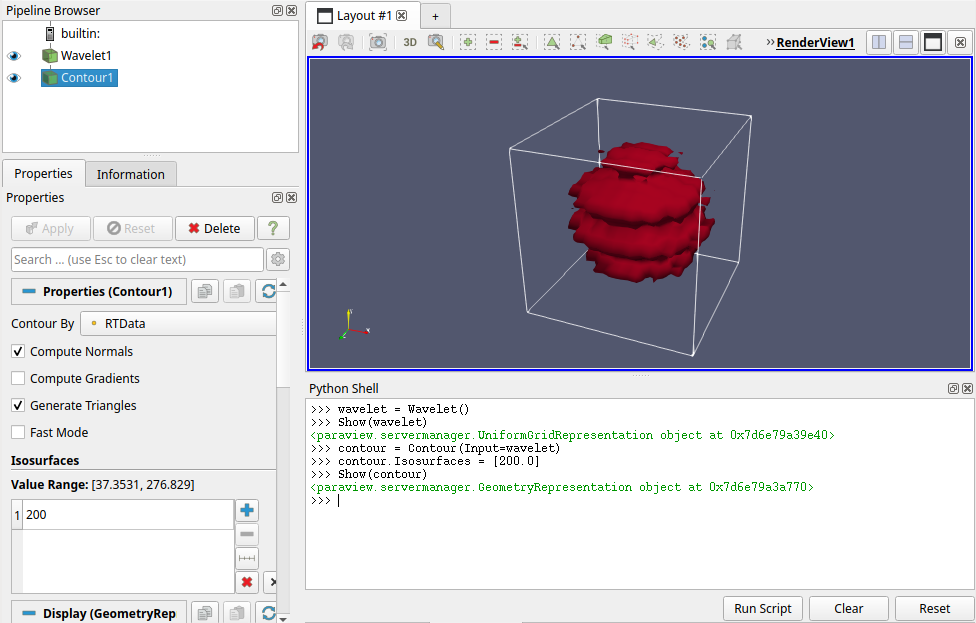
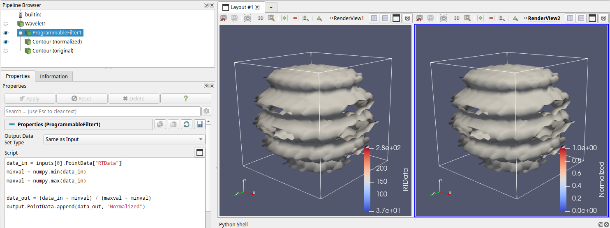

---
hide:
    - navigation
---

# Scripting

ParaView comes with a Python 3.x layer that can be used for several different tasks:

* Automating visualization workflows
* Saving and restoring the ParaView state
* Creating custom filters
* Creating custom plots

Obviously, Python scripting is an extensive and technically-oriented topic, and we won't go deep into the peculiarities of learning the Python API in ParaView. The best resources for that are the official tutorials, starting with the [Python & Batch: ParaView & Python chapter](https://docs.paraview.org/en/latest/Tutorials/ClassroomTutorials/pythonAndBatchParaViewAndPython.html). A dedicated set of ParaView Python documentation is available [here](https://kitware.github.io/paraview-docs/latest/python/index.html).

Below, we discuss the different possibilities listed above in more detail.

## Interaction tracing

The easiest way to get started with Python scripting from the ParaView GUI is to use the Trace feature:

* `Tools > Start Trace`, adjust options in the Trace Options dialog as needed (usually the defaults are fine), press OK.
* Perform actions within the GUI (for example, load a data file, add a Contour filter, press Apply)
* `Tools > Stop Trace`

The Python Script Editor window will pop up and will show the Python code representing the actions you performed. The script will usually contain quite a few more things than you did yourself in the GUI, as it records low-level implicit actions as well, for example related to rendering and updating the views. 

In principle, the generated script is self-contained and can be run later using the methods described below, for example from the command-line. Or you can use a Python trace as a basis for writing your own Python code for creating automated ParaView workflows.

## Saving state

A different way to get a Python representation from your current scene state is to use `File > Save State`, pick `Python state file` as file type, and then save to a .py file. In most cases the defaults in the Python State Options window are good enough.

The written script usually contains quite a bit of code, as it represent not just the scene in terms of filters, but also the UI state and things like animation state.

A Python state file (and trace as well) can later be re-executed using `File > Load State`, picking `Python state file` as file type. Note that in this case the current state is *not* cleared, so the script will add to the current state.

Also note that no data used by the filter pipeline is stored in the state, only the pipeline setup (i.e. filter types, parameters and connections). So when re-executing the state the data files referenced by pipeline filters need to be available for reading.

!!! Tip "Saving (XML) state in a screenshot file"

    An interesting feature that was added in ParaView 5.12 is to save the current state as XML metadata (so not as Python) in a screenshot PNG file. This only works for screenshots in PNG file format.

    Use `File > Save Screenshot`, pick PNG as image type, enter the file name, click OK and then in the Save Screenshot Options dialog enable `Embed ParaView State`. The resulting PNG file can then later be loaded with `File > Load State`.

    The reason for mentioning such non-Python state here is that you can save such screenshots from Python by passing `EmbedParaViewState=1` to the `SaveScreenshot()` function, which might be interesting for scripts doing batch-oriented rendering.


## Command-line execution

To run Python scripts from the command-line ParaView provides two executables, `pvpython` and `pvbatch`:

* `pvpython` allows interactive use, as well as batch execution of Python scripts.
* `pvbatch` is very similar to `pvpython`, but it can only run scripts, there's no interactive prompt. However, it can be run under MPI to allow parallel processing of larger datasets, something that isn't possible with `pvpython`.

!!! info "Remote and parallel usage"

    There's another [difference](https://docs.paraview.org/en/latest/ReferenceManual/parallelDataVisualization.html) between `pvpython` and `pvbatch` in that `pvpython` can be used to connect to a running ParaView server, thereby allowing remote (client-server) usage. In contrast, `pvbatch` always runs locally on the system and cannot connect as a client to a ParaView server.

`pvpython` contains GUI-related components, so it might show windows when executing certain commands (such as making a screenshot).

```py
$ pvpython
Python 3.11.8 (main, Feb 12 2024, 14:50:05) [GCC 13.2.1 20230801] on linux
Type "help", "copyright", "credits" or "license" for more information.
>>> from paraview.simple import *
>>> wavelet = Wavelet()
>>> Show(wavelet)
[openvkl] application requested ISPC device width 8via device name cpu_8
[openvkl] CPU device instantiated with width: 8, ISA: AVX2
<paraview.servermanager.UniformGridRepresentation object at 0x71244c38f8d0>
>>> contour = Contour(Input=wavelet)
>>> contour.Isosurfaces = [200.0]
>>> Show(contour)
<paraview.servermanager.GeometryRepresentation object at 0x71244c3f8550>
>>> SaveScreenshot("iso.png")
# Shows window, which stays open
True
>>> 
```

The above shows interactive usage, while you can also run a script from a file, just like regular `python`:

```py
$ cat wavelet-contour.py 
from paraview.simple import *

wavelet = Wavelet()
Show(wavelet)

contour = Contour(Input=wavelet)
contour.Isosurfaces = [200.0]
Show(contour)

SaveScreenshot("iso.png")

$ pvpython wavelet-contour.py 
[openvkl] application requested ISPC device width 8via device name cpu_8
[openvkl] CPU device instantiated with width: 8, ISA: AVX2
# Briefly shows windows, which closes when the script is done
```

!!! Tip "Offscreen rendering"

    Both `pvpython` and `pvbatch` support a `--force-offscreen-rendering` option, which avoids creating windows when rendering images. Depending on the system configuration where you're running ParaView this might or might not work. 

## GUI support

!!! Tip "Output messages area"

    Enable `View > Output Messages` and dock it somewhere in the GUI so you can see any output or errors when executing Python scripts.

### The Python Shell

To work more interactively with scripting you can enable `View > Python Shell`. This adds an interactive Python prompt to the UI. There, you can enter Python commands and see the results right away.



The Python Shell also allows you to easily run Python script files using the `Run Script` button. Note that these get executed within the current scene state, the scene is not cleared first.

### The Python Script Editor window

ParaView contains a dedicated Python editor window, which can be shown using `Tools > Python Script Editor`. It also gets shown automatically to hold any traces made, as described earlier.

The editor window provides a syntax-highlighted area for Python code, and has limited editing facilities. It also appears to be a bit buggy in certain uses, so using an external editor might be preferable.

## Programmable Filter

The Programmable Filter (and similar Programmable Source) allows you to create a custom filter using Python. A Programmable Filter is a pipeline filter in all respects. It takes an input dataset and produces an output dataset of a chosen type. It can compute any function that you can write in Python (including use of packages). There's special support for making [NumPy usage](https://docs.paraview.org/en/latest/ReferenceManual/vtkNumPyIntegration.html) easier with Paraview (and VTK) data types.

Let's say we wanted to create a filter that normalizes a dataset using the minimum and maximum value ranges. Below is Python code for such a programmable filter, applied to a dataset having point data array "RTData":

``` py
data_in = inputs[0].PointData["RTData"]
minval = numpy.min(data_in)
maxval = numpy.max(data_in)

data_out = (data_in - minval) / (maxval - minval)
output.PointData.append(data_out, "Normalized")
```

In this case, the upstream filter whose data we are processing is a Wavelet source. The `inputs` array contains all input ports of the programmable filter, of which there is just one here, which is receiving data from the upstream wavelet source. On that input port we retrieve the point data array named "RTData" (which a wavelet value for each 3D point). We compute min and max values and normalize the input array in one go, thanks to NumPy, and then set that as the point data output array called "Normalized".

Here's the GUI showing the pipeline, the code set on the programmable filter, as well as isosurfaces halfway in the data range, for the original wavelet dataset (left), and the normalized one (right). Note the different color map ranges.



As you can see, it is quite easy to write a custom filter. As long as you can express whatever operation you need in Python. And for large datasets the operation needs to be efficient to execute, unless you don't mind waiting a bit.

However, in this example the output data was a simple 3D array, containing per-point values, so that made the operation easy to express. But when you want to produce more exotic data types, such as 3D geometry, you will need to create data that adheres to the ParaView/VTK [data model](https://docs.paraview.org/en/latest/UsersGuide/understandingData.html#vtk-data-model).

Editing the filter code can also be a bit cumbersome. The code area does not show a lot of lines, so you might need to scroll for longer scripts. With the {.iconimg} button you can open the Script Editor window in *linked* mode: any changes you make in the editor window will be applied to the filter code, and vice versa. You can even save the code to a script file from the Editor Window. However, it forces you to use the separate Editor Window, which will overlap the main GUI.

## Python View

Finally, there is the [Python View](https://docs.paraview.org/en/latest/UsersGuide/displayingData.html#python-view): a view area that shows an image that you create using a Python script. It can be used for custom plots, or any other type of image display. It is not the most efficient to use, unfortunately:

* It does not operate as a filter receiving upstream data, so the script needs to be hardcode explicitly which data it needs. This introduces a dependency between scene state and view code.
* Updating the view (i.e. when you change the script code) can't be forced with a button, but is handled implicitly when the Python View is redrawn.
* Error handling seems to be a bit buggy, with Python syntax errors causing ParaView to crash sometimes.

For these reasons, we don't recommend using the Python View, unless you really need custom plot types within ParaView.

